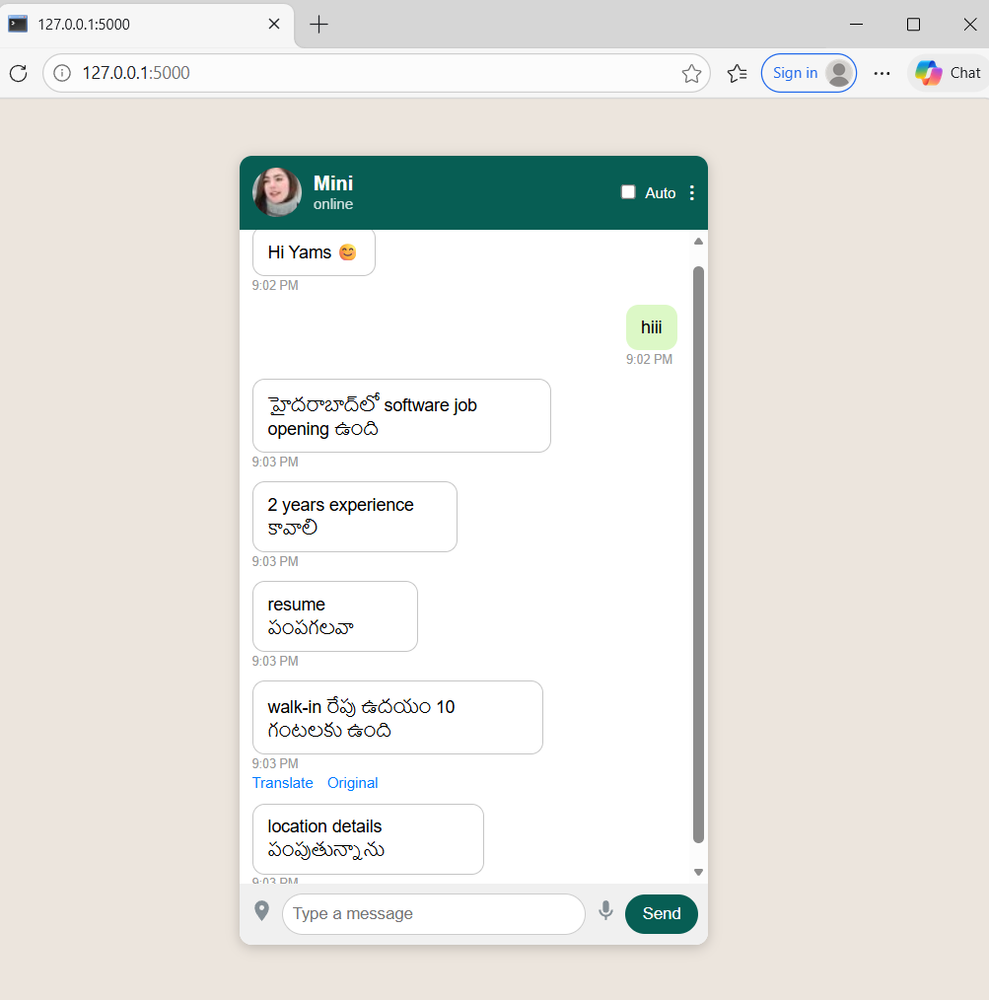
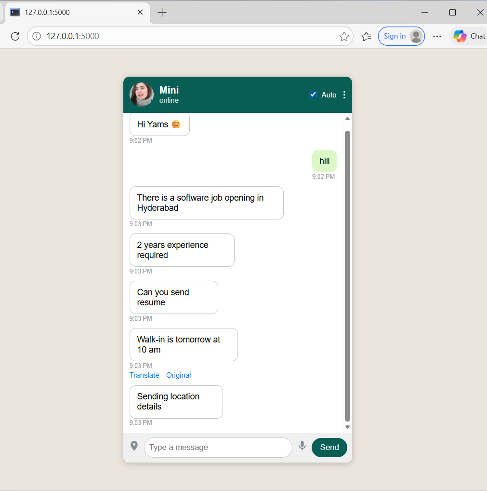

# 🌍 Multilingual Chat Translator

An AI-powered chat interface that automatically translates messages between multiple languages in real-time, helping users communicate seamlessly in multilingual environments.

## 📌 Problem Statement

In many group chats (such as WhatsApp, Telegram, or online collaboration platforms), users often communicate in different regional languages. This creates communication barriers because not everyone understands every language used in the conversation.

Existing solutions require users to:

* Copy the message
* Paste it into a translator(ai)
* Translate manually
* Return to the chat

This process is slow, inconvenient, and disrupts the flow of conversation.

## 💡 Our Solution

The **Multilingual Chat Translator** solves this problem by automatically translating chat messages into the user's preferred language in real-time.

Users can:

* Send messages in their own language
  
* Automatically translate received messages - individual message or the whole chat(using auto transalate mode)
  
* Communicate smoothly across language barriers without the need of coping messages / screeshot , then using transalator .

This creates a **more inclusive and efficient communication experience**.

## ⚙️ Features

* 🌐 Automatic language translation
* 💬 Real-time chat interface
* 🧠 AI-powered translation
* ⚡ Fast and user-friendly UI
* 🔁 Supports multiple languages
* 📱 Simple web-based interface

## 🛠️ Tech Stack

**Frontend**

* HTML
* CSS
* JavaScript

**Backend**

* Python
* Flask

**AI / Language Processing**

* Translation API / Language model integration

## 🖼️ Prototype

## 🚀 How to Run the Project

### 1️⃣ Clone the repository

git clone https://github.com/YAMINI-1408/multilingual-chat-translator.git

### 2️⃣ Navigate to the project folder

cd multilingual-chat-translator

### 3️⃣ Install dependencies

pip install -r requirements.txt

### 4️⃣ Run the application

python app.py

### 5️⃣ Open in browser

http://127.0.0.1:5000

## 📈 Future Improvements

* Voice-to-text translation
* Real-time group chat integration
* Mobile app version
* More advanced AI translation models
* willing to integrate this feature within the exiting messaging platforms. 
* End-to-end encrypted multilingual messaging

## 👩‍💻 Author

**D Yamini**

B.Tech Student 
Interested in AI, Machine Learning, and Real-world problem solving.

## ⭐ Contribution

If you find this project useful, feel free to **fork the repository and contribute**.
